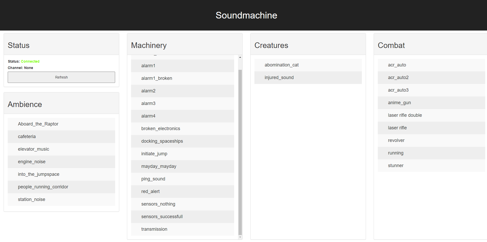

# Soundmachine
 
 **The commercial use of this project or any of its components, including sounds and images, is forbidden.**
 
 
 Simple Discord-bot and Flask-webserver for RPG sounds via Discord.
 
 The example sounds are for traveller.
 To add your own Sounds just place them in the corresponding directories.
 
## Sounds
Exemplary scifi samples to use for pen and paper rpgs. All sounds were recorded by ourselves, except for 

- `hull_breach.flac` 
- `initiate_jump.flac`
- `mayday_mayday.flac` 
- `reactor_breach.flac` 
- `red_alert.flac`

where we used Google's text-to-speech tool (https://cloud.google.com/text-to-speech).

## Notes
Since the bot uses a web-interface to play sounds 
for each instance of the Bot another one has to be setup.

## Setup & Usage
The shown version was tested on a raspberry pi.
If you use windows change `ffmpeg` in `bot.py` to `ffmpeg.exe`.

1. Install `ffmpeg`
2. Install the modules:
    -   flask
    -   discord.py
3. Register a own bot for Discord (https://discord.com/developers/applications)
	- Add a new application named "Soundmachine"
	- Klick on the application. On the left side the follwing should appear:  
	
	
	- To STEP 4:
		- Select the Bot menu and Copy the Token (under Build-A-Bot, next to the profile picture)
		- Insert the token in the token.txt  
		
	- To STEP 5:
		- Select OAuth2 and select `bot` under **OAuth2 URL Generator** 
		- Select `Connect`, `Speak`, `Send Messages` and `Read Message History`
		- Copy the link in between the SCOPES and BOT PERMISSIONS (This is the invitation Link for your bot)  
		
4. Create a token.txt in the directory of this project (next to `bot.py`) and insert the Token you gain for your bot there.
5. Add the bot to a Discord server
6. Start `gui.py` and wait till the bot is online at the server
7. Place yourself into a voice-channel
8. Type `!join` into a chat on the server the bot has access to. -> The bot should join your voice-channel
9. Open the website. The address is given by `<ip of device>:5000` (in local network only)  

10. Tap on any sound and the bot should play it.

Type `!leave` into the chat before closing your application. The bot should then leave the voice-channel.
